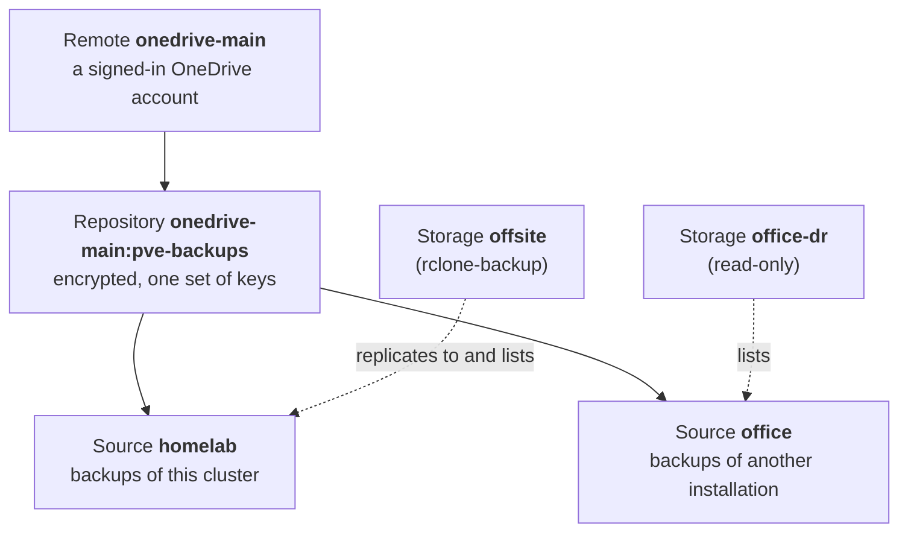

# How it works

## Parts

| Part | What it does |
|---|---|
| `pve-rclone-backupd` | The daemon. It runs on every node and does all the work: it finds finished archives, uploads them, verifies them, applies retention, and runs fetches and restores. Each node's daemon works on that node's backups. rclone is built into it; no separate rclone installation is used. |
| `pve-rclone-backup` | The command line tool and, with `pve-rclone-backup tui`, the terminal interface. Both only talk to the daemon. |
| Storage plugin | Adds the storage type `rclone-backup` to Proxmox VE, so that offsite backups appear in the GUI, `pvesm` and the API. |

The command line tool and the plugin reach the daemon through the socket
`/run/pve-rclone-backup/api.sock`, which only root can use. The daemon opens no network ports.

## Remotes, repositories and storages

- A **remote** is a cloud account the daemon can reach, such as a OneDrive account you signed in
  to. Its credentials are stored in `/etc/pve/priv/pve-rclone-backup/remotes.conf`, readable only by
  root.
- A **repository** is a folder in a remote that holds offsite backups. By default it is encrypted,
  with random keys of its own.
- A **source** is the part of a repository that belongs to one Proxmox VE installation or cluster.
  Several installations can share a repository, each under its own source name, without seeing
  each other's backups.
- A **storage** of type `rclone-backup` ties these together in Proxmox VE: it names the remote,
  the repository path and the source. It also says which local storages to replicate from.

## From backup job to offsite backup

1. A backup job writes an archive to a local storage, such as
   `/var/lib/vz/dump/vzdump-qemu-100-2026_10_04-02_00_01.vma.zst`. vzdump gives an archive its final
   name only when the backup has succeeded, so failed backups are never uploaded.
2. The daemon notices the new archive through inotify, a periodic scan, or the optional
   [vzdump hook](replication.md#the-vzdump-hook). It checks the storage's rules (which guests,
   how often) and queues an upload.
3. Once the archive has been unchanged for a minute, the daemon uploads it in segments (1 GiB by
   default). Each segment is encrypted on the fly, and the cloud's checksum of the stored data is
   checked. After every segment, progress is saved, so a restart resumes with the next segment.
4. The daemon checks that every segment is present with the right size and checksum. It then
   writes the backup's **manifest**: the archive's name, size and SHA-256, the segment list, and
   the guest's configuration. The manifest is written last: a backup without one is incomplete and
   is never listed.
5. The backup appears in the storage's catalogue and in Proxmox VE.

The local archive is only read, never changed. Proxmox VE's local retention can delete it once it is
offsite; deleting or pruning local backups never deletes offsite backups.

## The catalogue

Each daemon keeps a catalogue of offsite backups in `/var/lib/pve-rclone-backup/state.db`, so
that listing backups in Proxmox VE never needs the network. The catalogue is a cache: the manifests
in the cloud are the authoritative record. The daemon rebuilds the catalogue from them regularly
(every 6 hours, and at the storage's `rclone-verify-interval`). It also rebuilds it on demand
(`pve-rclone-backup storage resync`), and when the database is lost.

## Encryption

Repositories are encrypted with [rclone crypt](https://rclone.org/crypt/) by default:

- file contents in 64 KiB blocks, each authenticated;
- file and folder names.

The cloud provider only sees encrypted data of roughly the original size. The keys are random and
stored in `/etc/pve/priv/pve-rclone-backup`; the [recovery kit](recovery-kit.md) is your copy of
them.

## Restores

Restores read the segments in order, decrypt them, and check each segment and the whole archive
against the SHA-256 digests in the manifest. VM archives can be streamed straight into `qmrestore`.
Container archives are staged on local disk first and restored with `pct restore`. A backup can
also be fetched back into a local backup storage, where Proxmox VE restores it like any other
backup. See [Restoring](restore.md).
