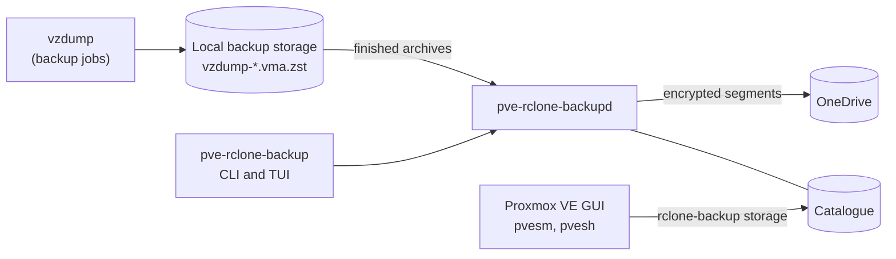

# pve-rclone-backup

pve-rclone-backup copies your Proxmox VE backups offsite to cloud storage, using rclone. The first
supported cloud is Microsoft OneDrive Personal.

!!! warning "Pre-alpha"
    Replication, verification, retention, fetch and restore all work through the command line and
    the terminal interface, and an installable package is available. Each change is tested on a
    nested Proxmox VE 9.2 node. pve-rclone-backup has **not yet been tested against a real OneDrive
    account**. Keep your local backups, and test restores before you rely on it.

## What it does

- **Your backups stay as they are.** Proxmox VE keeps writing its normal vzdump backups to local
  storage, and you keep scheduling backup jobs in Proxmox VE as before.
- **Archives go offsite on their own.** The `pve-rclone-backupd` daemon notices each finished
  archive and uploads it in the background, byte for byte. Uploads are encrypted and split into
  segments, so an interrupted upload resumes where it stopped.
- **A slow or broken cloud never affects local backups.** Uploads wait and retry; backup jobs
  never wait for the cloud. No second local copy of an archive is made.
- **Offsite backups appear in Proxmox VE.** A storage of type `rclone-backup` lists them on the
  Backups tab, with their notes, protection and guest configuration. It shows the cloud's quota
  and applies an offsite retention policy.
- **Restores work without the original host.** Every offsite backup carries a manifest that
  describes it. With the recovery kit, a fresh Proxmox VE host can rebuild the list of backups from
  the cloud alone. Even without this tool, stock rclone can reassemble the archives.

## Where to start

- **[Requirements](getting-started/requirements.md)**: what you need before installing.
- **[Installation](getting-started/installation.md)**: build and install the package.
- **[Quick start](getting-started/quick-start.md)**: from a OneDrive account to your first offsite
  backup.
- **[Disaster recovery](dr-runbook.md)**: get guests back after losing the host.
- **[Command line reference](reference/cli/index.md)**: every command and option.
- **[Storage properties](reference/storage-properties.md)**: every setting of an offsite storage.

## License

pve-rclone-backup is free software under the GNU Affero General Public License, version 3 or later.
The source is on [GitHub](https://github.com/ariedotcodotnz/pve-rclone-backup).
